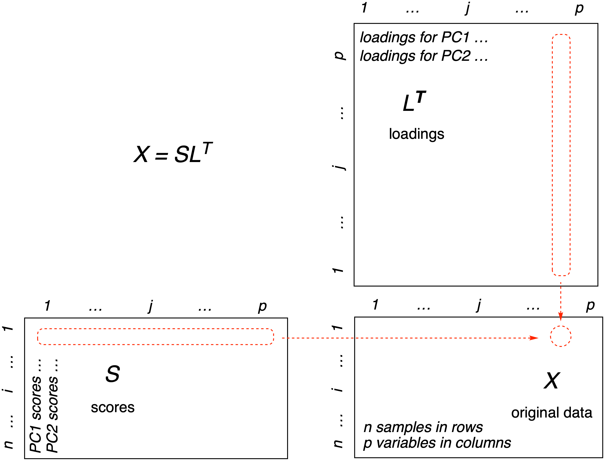

```{r SetUp, echo = FALSE, eval = TRUE, results = "hide"}
# R options & configuration:
set.seed(9)
rm(list = ls())
suppressPackageStartupMessages(library("knitr"))
suppressPackageStartupMessages(library("kableExtra"))
suppressPackageStartupMessages(library("chemometrics"))

# Stuff specifically for knitr:
opts_chunk$set(eval = TRUE, echo = TRUE)
options(rmarkdown.html_vignette.check_title = FALSE)
```

<!-- This chunk inserts common info about all the vignettes -->

```{r, echo = FALSE, results = "asis"}
res <- knitr::knit_child("top_matter.md", quiet = TRUE)
cat(res, sep = '\n')
```

In this vignette we'll look closely at how the data reduction step in PCA is actually done.  This vignette is intended for those who really want to dig deep.  It's helpful if you know something about matrix manipulations, but we work hard to keep the level of the material accessible to those who are just learning.

# Introduction

If you have read the [Step By Step PCA](#top-matter) vignette, you know that the first steps in PCA are:

1. Center the data by subtracting the column means from the columns.
1. Optionally, scale the data column-wise.
1. Carry out the reduction step, typically using `prcomp`.

For a data matrix with $n$ rows of observations/samples and $p$ variables/features, the results are the

* scores matrix with $n$ rows and $p$ columns, where each column corresponds to a principal component and the values are the scores, namely the positions of the samples in the new coordinate system.
* loadings matrix with $p$ rows and $p$ columns, which represent the contributions of each variable to each principal component.

In the [Step By Step PCA](#top-matter) vignette we also showed how to reconstruct or approximate the original data set by multiplying the scores by the transpose of the loadings.

In Figure \@ref(fig:PCA-Matrices) we show one way to represent the relationships between the original data matrix ($\mathbf{X}$), the loadings matrix ($\mathbf{L}$) and the scores matrix ($\mathbf{S}$).

```{r PCA-Matrices, echo = FALSE, results = "show", fig.cap = "One way to look at the matrix algebra behind PCA. Reconstruction of the data matrix $\\mathbf{X}$ is achieved by multiplying the score matrix ($\\mathbf{S}$) by the transpose of the loadings matrix ($\\mathbf{L}$).  The method of matrix multiplication is symbolized in the red-dotted outlines: Each element of row $i$ of the scores matrix is multiplied by the corresponding element of column $j$ of the transposed loadings.  These results are summed to give a single entry in the original data matrix $\\mathbf{X}_{ij}$.", out.width = "75%", fig.align = "center"}


```

Figure \@ref(fig:PCA-Matrices) demonstrates that if we multiply the scores matrix ($\mathbf{S}$) by the transpose of the loadings matrix ($\mathbf{L^T}$), we get back the original data matrix ($\mathbf{X}$).  When we start however, all we have is the original data matrix, how do we get the other two matrices?  If we think of this as an algebra problem, we seem to be missing some variables; computing the loadings and scores matrices seems like it would be impossible, as there is not enough information.   However, this is not a algebra problem, it is a *linear* algebra problem (linear algebra being the study of matrices).  It *is* possible to determine the answer, even though we seem to be missing information, as we shall see shortly.  The key is in something called matrix decompositions.[^1]

# Matrix Decompositions

In a moment we are going to look at two matrix decompositions in detail, the singular value decomposition (SVD) and the eigenvalue decomposition. These decompositions are representative of roughly a dozen [matrix decompositions](https://en.wikipedia.org/wiki/Matrix_decomposition).  A matrix decomposition or factorization breaks a matrix into pieces in such a way as to extract information and solve problems.  The SVD is probably the most powerful decomposition there is -- we will make extensive use of  this insightful [Twitter thread](https://twitter.com/WomenInStat/status/1285610321747611653) by Dr. Daniela Witten of the University of Washington. We also use this excellent [Cross Validated answer by amoeba](https://stats.stackexchange.com/a/134283/26909).

A short note however, before we dig deeper.  Since we are using a computer to solve this problem, we need to keep in mind that using a computer is not quite the same as solving a problem using pencil and paper. On the computer, we usually have choices of algorithms to solve problems.  Some algorithms are more robust than others.  Algorithms need to take into account edge cases where the computation can become unstable.  For instance, computers can only store numbers to a certain level of accuracy: when is "very small" actually zero in practice?  We need to know this so we don't try to divide by zero.  This is only one example of problems that can arise when using a computer to calculate values.

Finally, the two decompositions we are going to look at have something in common.  Our approach will be to explain each without reference to the other, as this facilitates digestion and understanding of each (it doesn't seem fair to require you to understand the 2nd one that you haven't read while trying to understand the first one).  Then, if you are still with us, we'll look at what they have in common.

# The SVD Decomposition

We'll start from the original data matrix $\mathbf{X}$ which has samples in rows and measured variables in columns.  Let's assume that we have column-centered the matrix.  The SVD decomposition breaks this matrix $\mathbf{X}$ into three matrices (dimensions in parentheses):[^5]

\begin{equation}
(\#eq:svd1)
\mathbf{X}_{(n \ \times \ p)} = \mathbf{U}_{(n \ \times \ p)}\mathbf{D}_{(p \ \times \ p)}\mathbf{V}_{(p \ \times \ p)}^T
\end{equation}

And here's the equation without matrix dimensions. Remember that $\mathbf{V}^T$ means "take the transpose" of $\mathbf{V}$, interchanging rows and columns.

\begin{equation}
(\#eq:svd2)
\mathbf{X} = \mathbf{U}\mathbf{D}\mathbf{V}^T
\end{equation}

The equation above is where we'd like to end up.  How can we get there?  Let's start with *What are these matrices*?

* $\mathbf{X}$ contains the original data
* The columns of $\mathbf{U}$ are vectors giving the principal axes. These define the new coordinate system.
* The scores can be obtained by $\mathbf{X}\mathbf{V}$; scores are the projections of the data on the principal axes.
* $\mathbf{D}$ is a diagonal matrix, which means all non-diagonal elements are zero.  The diagonal contains positive values sorted from largest to smallest.  These are called the singular values.[^9]
* The columns of $\mathbf{V}$ are the PCA loadings

In addition, $\mathbf{U}$ and $\mathbf{V}$ are semi-orthogonal matrices,[^4] which means that when pre-multiplied by their transpose one gets the identity matrix:[^12]

\begin{equation}
(\#eq:svd3)
\mathbf{U}^{T}\mathbf{U} = \mathbf{I}
\end{equation}

\begin{equation}
(\#eq:svd4)
\mathbf{V}^{T}\mathbf{V} = \mathbf{I}
\end{equation}

We'll use this fact to great advantage when we implement a simple version of SVD in a moment.

# A Simple Implementation of SVD

Now that we know what these matrices are, we can look into how to compute them.  As mentioned earlier, the algorithm is everything here.  As a simple example, we'll look at an approach called "power iteration." This is by no means the best approach, but it is simple enough that we can understand the idea.  First, let's generate some random data. In this simple example we are only going to compute the first principal component, so `V` is a vector, not a matrix (one can still do matrix multiplication with a vector, we just treat it as a "row vector" or a "column vector").[^2]  Note that the dimensions of the variables are chosen so that we can matrix multiply them (they are *conformable* matrices).

```{r power1}
set.seed(30)
X <- matrix(rnorm(100*50), ncol = 50)
V <- rnorm(50)
```

Next, we'll use the built-in function `svd` to compute the "official" answer for comparison to our results.

```{r power2}
X_svd <- svd(X)
```

We'll do a simple iterative calculation that computes the values of `U` and `V`.  The loop runs for 50 iterations, and as it does the values of `U` and `V` are continuously updated and get closer to the actual answer.

```{r power3}
for (iter in 1:50) {
  U <- X %*% V # Step 1
  U <- U/sqrt(sum(U^2)) # Step 2
  V <- t(X) %*% U # Step 3
  V <- V/sqrt(sum(V^2)) # Step 4
 if ((iter %% 10) == 0L) { # report every 10 steps; print the correlation between
   cat("\nIteration", iter, "\n") # the current U or V and the actual values from SVD
   cat("\tcor with V:", sprintf("%f", cor(X_svd$v[,1], V)), "\n")
   cat("\tcor with U:", sprintf("%f", cor(X_svd$u[,1], U)), "\n")
   }
}
```

Notice that there is no $\mathbf{D}$ matrix in this calculation.  This is because we are only calculating a single principal component, and therefore in this case $\mathbf{D}$ is a scalar constant.  We can drop it from the calculation.  With that simplification, we can look at each step.

## Step 1

The first step is to multiply the data matrix `X` by the initial estimate for `V` (remember at each iteration the estimate gets better and better).  How does this relate to Equation \@ref(eq:svd2)? If we drop $\mathbf{D}$ from equation \@ref(eq:svd2) we have:

\begin{equation}
(\#eq:svd5)
\mathbf{X} = \mathbf{U}\mathbf{V}^T
\end{equation}

If we right multiply both sides by $\mathbf{V}$ we have:

\begin{equation}
(\#eq:svd6a)
\mathbf{X}\mathbf{V} = \mathbf{U}\mathbf{V}^T\mathbf{V}
\end{equation}

which evaluates to:

\begin{equation}
(\#eq:svd6b)
\mathbf{X}\mathbf{V} = \mathbf{U}\mathbf{I} = \mathbf{U}
\end{equation}

because $\mathbf{V}$ is a semi-orthogonal matrix. This is the line in the code.

## Step 2

In this step we normalize (regularize, or scale) the estimate of `U`, by dividing by the square root of the sum of the squared values in `U`.[^6] This has the practical effect of keeping the values in `U` from becoming incredibly large and possibly overflowing memory.[^7]

## Step 3

Here we update our estimate of `V`.  Similar to Step 1, we can rearrange Equation \@ref(eq:svd2), this time by dropping $\mathbf{D}$, pre-multiplying both sides by $\mathbf{U}^T$ to give an identity matrix which drops out, and then transposing both sides:

\begin{equation}
(\#eq:svd7)
\mathbf{U}^T\mathbf{X} = \mathbf{U}^T\mathbf{U}\mathbf{V}^T
\end{equation}

\begin{equation}
(\#eq:svd8)
\mathbf{U}^T\mathbf{X} = \mathbf{I}\mathbf{V}^T
\end{equation}

\begin{equation}
(\#eq:svd9)
\mathbf{U}^T\mathbf{X} = \mathbf{V}^T
\end{equation}

\begin{equation}
(\#eq:svd10)
(\mathbf{U}^T\mathbf{X})^T = (\mathbf{V}^T)^T
\end{equation}

\begin{equation}
(\#eq:svd11)
\mathbf{X}^T\mathbf{U} = \mathbf{V}
\end{equation}


which is the operation we see in the code snippet.[^3]

## Step 4

Step 4 is the same operation as in Step 2, but on `V`.

## Overall

Essentially what this algorithm is doing is alterating between the two calculations (for `U`, steps 1 & 2, then for `V` steps 3 & 4), with `X` constant.  At each iteration these estimates improve, moving from the initial random value of `V` towards the best answer for both `V`and `U`.

## Reporting

You'll notice that the code snippet above has a few lines to report the progress of the calculation.  Every 10 steps the correlation between the current value of `V` with the official answer contained in `X_svd$v` is displayed (and the same for `U`).  As you can see from the output the correlation is not bad after 10 iterations and only improves with more iterations. We report the correlation because the signs of the power iteration answers may vary from those computed by `svd`.[^14]

## Comparison to the Answer from `svd`

Let's compare the absolute values of the two different answers:

```{r comp1}
mean(abs(V) - abs(X_svd$v[,1]))
mean(abs(U) - abs(X_svd$u[,1]))
```

As you can see, the values are essentially the same except for sign.

## Comparison to the Answer from `prcomp`

We have seen that our estimate of `U` and `V` compared well to the results from the function `svd`.  In practice users would probably use `prcomp` for PCA.  So let's compare to the results from `prcomp`.

```{r}
PCA <- prcomp(X)
mean(abs(X %*% V) - abs(PCA$x[,1])) # compare the scores
mean(abs(V)- abs(PCA$rotation[,1])) # compare the loadings
```

These mean differences are very small but not quite as good as using `svd` directly.

Notice that we have worked through the SVD without mentioning eigen-anything.  That was one of our goals.  Now let's take a different point of view.

# The Eigen Decomposition

The eigen decomposition is another way to decompose a data matrix. This decomposition breaks the data matrix $\mathbf{X}$ into two matrices.[^8] Again, let's assume $\mathbf{X}$ has been centered.

\begin{equation}
(\#eq:ed1)
\mathbf{X}_{(n \ \times \ n)} = \mathbf{Q}_{(n \ \times \ n)}\mathbf{\Lambda}_{(n \ \times \ n)}\mathbf{Q}_{(n \ \times \ n)}^{T}
\end{equation}

And here's the equation without matrix dimensions.[^11]

\begin{equation}
(\#eq:ed2)
\mathbf{X} = \mathbf{Q}\mathbf{\Lambda}\mathbf{Q}^{T}
\end{equation}

The equation above is where we'd like to end up; it looks like a variation on the equation for SVD.  How can we get there?  Once again, let's take inventory of the matrices in the equation.

* $\mathbf{X}$ is the original data matrix.  Notice the dimensions are $n \times n$, unlike in SVD.  In other words, it is a square matrix.  Your data is not square you say?  Eigen decomposition requires an square matrix.  Fortunately, there's a simple fix for this.  We can work instead with the covariance matrix, which is square: $\mathbf{X}^T\mathbf{X}/(n - 1)$. This retains all the structure of the original data.[^13]
* $\mathbf{Q}$ is square matrix that whose columns will contain the *eigenvectors*.  $\mathbf{Q}$ is also an orthogonal matrix (discussed earlier in the SVD section).  Notice that $\mathbf{Q}$ appears twice in \@ref(eq:ed2), the second time as its transpose.
* $\mathbf{\Lambda}$ (upper case Greek letter Lambda) is a diagonal matrix, very similar in function to $\mathbf{D}$ in SVD. All non-diagonal elements are zero.  The diagonal contains values sorted from largest to smallest.  These are called the *eigenvalues*.

So what are eigenvectors and eigenvalues?  The eigenvalues are related to the amount of variance explained for each principal component. The eigenvectors are the principal axes, which as we have seen constitute a new coordinate system for looking at the data (see the [Visualizing PCA in 3D](#top-matter) vignette for details). If we post-multiply the original data by the eigenvectors in $\mathbf{Q}$ we get the scores:

\begin{equation}
(\#eq:ed4)
\mathbf{X}\mathbf{Q} = scores
\end{equation}

And the loadings are simply the eigenvectors in $\mathbf{Q}$.

## A Simple Implementation of the Eigen Decomposition

As we did for `SVD`, we can use a power iteration to compute estimates for the first eigenvector.

```{r eigen1}
set.seed(30)
X <- matrix(rnorm(100*50), ncol = 50)
X <- cor(X)
Q <- rnorm(50)
```

Next, we'll use the built-in function `eigen` to compute the "official" answer for comparison to our results.

```{r eigen2}
X_eig <- eigen(X)
```

A simple iterative process as we did for SVD will continuously update the value of `Q`.[^15]

```{r eigen3}
for (iter in 1:50) {
  Q <- X %*% Q # Step 1
  Q <- Q/sqrt(sum(Q^2)) # Step 2

 if ((iter %% 5) == 0L) { # report every 5 steps; print the correlation between
   cat("\nIteration", iter, "\n") # the current Q and the actual values from SVD
   cat("\tcor with Q:", sprintf("%f", cor(X_eig$vectors[,1], Q)), "\n")
   }
}
```

How does the final estimate for `Q` compare to the official answer?  We can check our result as before:

```{r}
mean(abs(Q) - abs(X_eig$vectors[,1])) # check the loadings
```

Good work by the power iteration!

# The Relationship Between SVD and Eigen Decomposition

It's apparent that SVD and the eigen decomposition have a lot in common.  The `R` function `prcomp` uses the `svd` function "under the hood", and the function `princomp` uses `eigen` under the hood. The vignette [PCA Functions](#top-matter) goes into greater detail about the similarities and differences between these two decompositions as implemented in `R`.

## Singular Values vs Eigenvalues

We've talked about "values" in the context of each decomposition.  Is this terminology accidental, or is there a relationship?  If you square the singular values from SVD and divide by $n -1$, you get the eigenvalues. Here "diagonal" means take the diagonal elements of the matrix (which would be a vector of values):

\begin{equation}
(\#eq:r1)
(diagonal(\mathbf{D}))^2/(n - 1) = diagonal(\mathbf{\Lambda})
\end{equation}

Either of these "values" can be used to compute the amount of variance explained by each principal component.  Details are in the [PCA Functions](#top-matter) vignette.

## Pros and Cons

* `svd` can handle rectangular matrices $n \times p$ where $n \ne p$.  Either $n > p$ or $n < p$ is acceptable.  On the other hand, `eigen` must have $n = p$. `prcomp` wraps `eigen` and helps the user convert their raw data matrix into a square matrix.

<!-- Insert refer_to_works_consulted document -->

```{r, echo = FALSE, results = "asis"}
res <- knitr::knit_child("refer_to_works_consulted.md", quiet = TRUE)
cat(res, sep = '\n')
```

# References

[^1]: If you need an introduction to linear algebra, there are many good books, but we particularly recommend @Singh2014 or @Savov2020.
[^2]: When refering to the mathematical equations, we'll use $\mathbf{X}$, but when referencing the values we compute, we'll use `X`.
[^3]: The operation from equation \@ref(eq:svd10) to \@ref(eq:svd11) is based upon the following property in linear algebra: $(AB)^T$ = $B^TA^T$.
[^4]: For semi-orthogonal matrices (or orthogonal matrices for that matter), $A^TA = AA^T = I$.  Semi-orthogonal matrices are rectangular.  For non-rectangular orthogonal matrices, if $n > p$, the dot product of any column with itself is 1, and the dot product of any column with a different column is zero.  If $n < p$, then it is the rows rather than the columns that are relevant.  See the [Wikipedia article](https://en.wikipedia.org/wiki/Semi-orthogonal_matrix).
[^5]: This treatment is the "compact SVD" [case](https://en.wikipedia.org/wiki/Singular_value_decomposition).
[^6]: This is the $L^2$ or Euclidean norm, generally interpreted as a length.
[^7]: As the values grow larger and larger, first we lose precision and eventually the numbers become too big to store.
[^8]: Eigenvalues and eigenvectors are extremely important in linear algebra.  The concept is usually introduced in the simpler form $Au = \lambda u$.
[^9]: The singular values are used to calculate the variance explained by each principal component. We'll have more to say about that later.
[^11]: One also sees this written $\mathbf{X} = \mathbf{Q}\mathbf{\Lambda}\mathbf{Q}^{-1}$.  This is equivalent because for orthogonal matrices $\mathbf{A}^T = \mathbf{A}^{-1}$.
[^12]: The identity matrix $\mathbf{I}$ is a square matrix with ones on the diagonal and zeros everywhere else.  The identity matrix can pre- or post-multiply any other matrix and not affect that matrix.
[^13]: We can also use the correlation matrix, which is evaluated via the same formula.  For covariance, one centers the raw data columns.  For correlation, one centers the raw data and then scales them by their standard deviation.
[^14]: From `?prcomp` "The signs of the columns of the rotation matrix are arbitrary, and so may differ between different programs for PCA, and even between different builds of R."  From `?princomp` "The signs of the columns of the loadings and scores are arbitrary, and so may differ between different programs for PCA, and even between different builds of R: fix_sign = TRUE alleviates that."  We discuss the origin of the different signs in more detail in [PCA Functions vignette](#top-matter).
[^15]: **TODO need reference**
